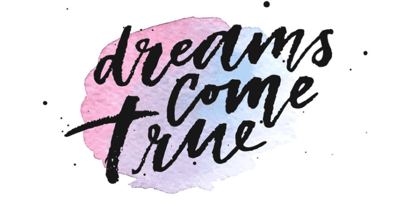

Hello,

I am a senior at Gettysburg College, US. I expect to graduate with a B.S degree in Computer Science and Math minor in 5/2024. I plan to continue my study as a PhD student in AI after graduation.

My current research interests are NLP, signal processing, and multimodality learning. Previously, I had a research project in music emotion recognition and a speech enhancement for Parkinson's Disease patient (audio-to-audio)

Sometimes, you will find I use the phrase: "Dreams Come True" because it is my motto. I want to pursue and make all my dreams come true.

